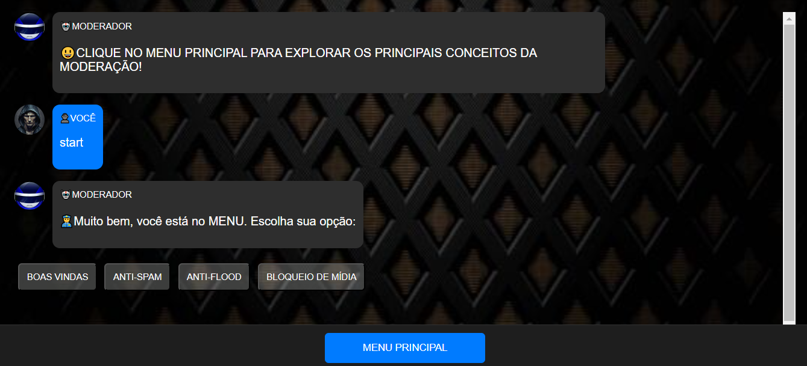

# MODERADOR
👨‍🏫ESTE CHATBOT PERMITE QUE OS USUÁRIOS EXPLOREM OS PRINCIPAIS CONCEITOS DA MODERAÇÃO!

    
  

## DESCRIÇÃO:
Este bot é um assistente interativo projetado para gerenciar um grupo no Telegram. Ele fornece opções para configurar mensagens de boas-vindas, aplicar filtros anti-spam, prevenir flood de mensagens e controlar a entrada de diferentes tipos de mídias no grupo. Os usuários podem interagir com o bot através de um menu de botões, tornando a experiência mais intuitiva e organizada.

## EXECUTANDO O PROJETO:
1. **Iniciar o Bot:**
   - Abra o arquivo `./CODIGO/index.html` no navegador de sua preferencia.
   - Ao começar a interagir com o bot, você verá uma mensagem de boas-vindas que indica que você está no menu principal. 
   - A mensagem é acompanhada de opções que você pode escolher clicando nos botões exibidos.

2. **Escolher uma Opção:**
   - Você pode escolher entre as seguintes opções clicando nos respectivos botões:
     - **BOAS VINDAS**: Define uma mensagem personalizada que será enviada a novos membros do grupo.
     - **ANTI-SPAM**: Configura um sistema que filtra mensagens indesejadas e links, ajudando a manter o grupo livre de spam.
     - **ANTI-FLOOD**: Impede que uma quantidade excessiva de mensagens seja enviada em um curto espaço de tempo, garantindo um fluxo de conversa mais controlado.
     - **BLOQUEIO DE MÍDIA**: Permite que você controle quais tipos de mídias podem ser enviadas no grupo (como fotos, vídeos, áudios, etc.).

3. **Interagir com as Respostas:**
   - Cada vez que você clica em uma opção do menu, o bot responde com informações detalhadas sobre a opção escolhida. 
   - Essas respostas podem incluir links para mais informações, que são exibidos em um formato que permite que você clique e acesse diretamente.

4. **Exemplo de Uso:**
   - Ao clicar no botão **BOAS VINDAS**, você verá uma mensagem explicando como definir uma mensagem de boas-vindas personalizada, com um link para mais detalhes.
   - Ao clicar em **ANTI-SPAM**, o bot explicará como a função anti-spam funciona, também com um link para mais informações.

## NÃO SABE?
- Entendemos que para manipular arquivos em `HTML`, `CSS` e outras linguagens relacionadas, é necessário possuir conhecimento nessas áreas. Para auxiliar nesse aprendizado, oferecemos cursos gratuitos disponíveis:
* [CURSO DE HTML E CSS](https://github.com/VILHALVA/CURSO-DE-HTML-E-CSS)
* [CURSO DE JAVASCRIPT](https://github.com/VILHALVA/CURSO-DE-JAVASCRIPT)
* [CURSO DE JQUERY](https://github.com/VILHALVA/CURSO-DE-JQUERY)
* [CONFIRA MAIS CURSOS](https://github.com/VILHALVA?tab=repositories&q=+topic:CURSO)

## CREDITOS:
- [PROJETO BASEADO NO "MYDEBOT"](https://github.com/VILHALVA/MYDEBOT)
- [PROJETO FEITO PELO VILHALVA](https://github.com/VILHALVA)