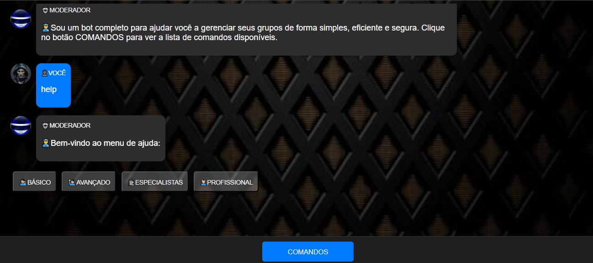
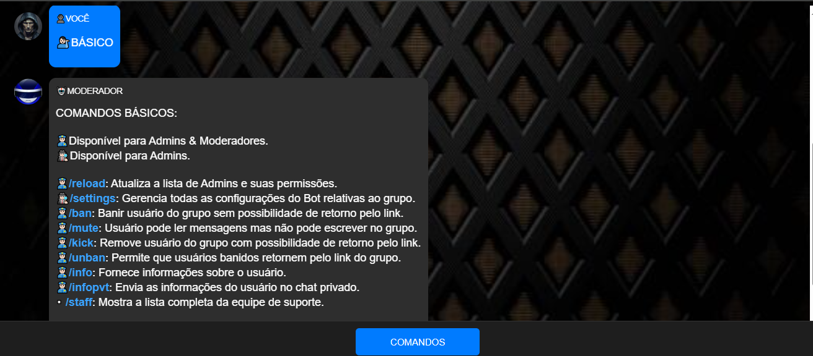

# MODERADOR
👨‍🏫ESTE CHATBOT PERMITE QUE OS USUÁRIOS EXPLOREM OS PRINCIPAIS COMANDOS DO MODERADOR!

 <br> <br>
 <br>

## DESCRIÇÃO:
Este projeto simula um **bot moderador para grupos do Telegram**, apresentado em uma **interface web interativa**.

O bot exibe menus organizados por categorias, explica comandos administrativos e oferece uma experiência visual **inspirada no Telegram**, incluindo:

* Menu com botões interativos;
* Mensagens formatadas com quebras de linha;
* Comandos e menções destacados automaticamente;
* Possibilidade de **copiar comandos e @menções ao clicar**;
* Feedback visual ao copiar (“✔Copiado”);
* Layout inspirado no chat do Telegram, com **avatar fixo durante o rolamento**, leitura contínua de cima para baixo e posicionamento inteligente das mensagens (sem cortes no título ou no nome do bot).

O objetivo do projeto é **demonstrar, documentar e facilitar o uso dos comandos de um bot moderador**, de forma intuitiva, organizada e visualmente familiar para usuários do Telegram.

## EXECUTANDO O PROJETO:
### INICIAR O PROJETO:
1. Abra o arquivo abaixo em qualquer navegador moderno:

```
./CODIGO/index.html
```

2. Ao carregar a página, o bot enviará uma mensagem inicial explicando sua função.
3. Um botão **COMANDOS** ficará disponível para iniciar a interação com o bot.

### NAVEGAR PELO MENU DE COMANDOS:
Ao clicar em **COMANDOS**, o bot exibirá um menu com botões interativos organizados por categoria:

* **💁🏻‍♂️ BÁSICO**  
Comandos essenciais para administração do grupo.

* **🙋🏻‍♂️ AVANÇADO**  
Gerenciamento de advertências, mensagens e ações administrativas.

* **🕵🏼‍♂️ ESPECIALISTAS**  
Ferramentas avançadas como mensagens fixadas, estatísticas e análise de membros.

* **💆🏻‍♂️ PROFISSIONAL**  
Sistema de suporte entre grupo principal e grupo de suporte, com ações sincronizadas.

Cada botão exibe uma explicação detalhada e organizada dos comandos disponíveis naquela categoria.

### INTERAGIR COM OS COMANDOS:
* Todos os comandos exibidos (ex: `/ban`, `/mute`, `/pin`, `/infopvt`) aparecem em **negrito**.
* Menções como `@ADM_GROUP_BOT` e `@ghStaffBot` também são destacadas.
* Os comandos e menções são **clicáveis**:

* Ao clicar, o texto é automaticamente **copiado para a área de transferência**.
* Um feedback visual é exibido no próprio texto: **“✔Copiado”**.
* Após alguns instantes, o texto original é restaurado.

* As mensagens respeitam **quebras de linha**, garantindo uma leitura clara e organizada, mesmo em textos longos.

## NÃO SABE?
- Entendemos que para manipular arquivos em `HTML`, `CSS` e outras linguagens relacionadas, é necessário possuir conhecimento nessas áreas. Para auxiliar nesse aprendizado, oferecemos cursos gratuitos disponíveis:
* [CURSO DE HTML E CSS](https://github.com/VILHALVA/CURSO-DE-HTML-E-CSS)
* [CURSO DE JAVASCRIPT](https://github.com/VILHALVA/CURSO-DE-JAVASCRIPT)
* [CURSO DE JQUERY](https://github.com/VILHALVA/CURSO-DE-JQUERY)
* [CONFIRA MAIS CURSOS](https://github.com/VILHALVA?tab=repositories&q=+topic:CURSO)

## CREDITOS:
- [PROJETO BASEADO NO "MYDEBOT"](https://github.com/VILHALVA/MYDEBOT)

- [PROJETO FEITO PELO VILHALVA](https://github.com/VILHALVA)
